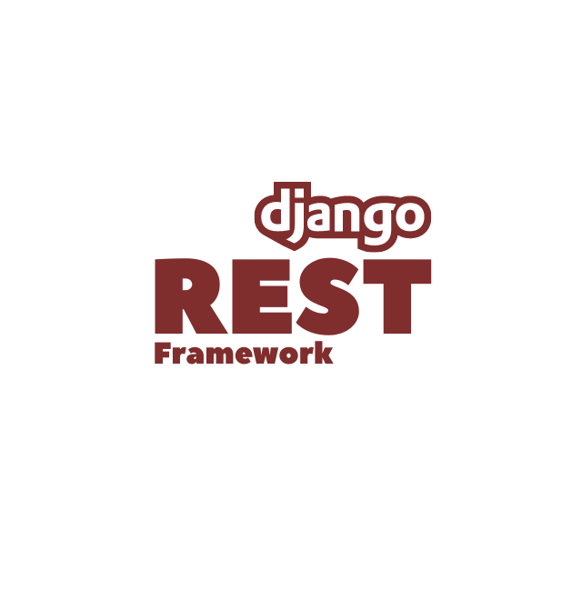

<h1 align="center">

</h1>

✅ Setup Environment  
✅ Creating a Python API Client  
✅ Run Django Project  
✅ Create first API View  
✅ Echo GET Data  
✅ Django Model Instance as API Response  
✅ Django Model Instance to Dictionary  
✅ Rest Framework View & Response  
✅ Django Rest Framework Model Serializers  
✅ Ingest Data with Django Rest Framework Views  
✅ Django Rest Framework Generics RetrieveAPIView  
✅ Django Rest Framework CreateAPIView  
✅ Django Rest Framework ListAPIView & ListCreateAPIView  
✅ Using Function Based Views for Create Retrieve or List  
✅ UpdateAPIView & DestroyAPIView  
✅ Mixins and a Generic API View  
✅ Session Authentication & Permissions  
✅ User & Group Permissions with DjangoModelPermissions  
✅ Custom Permissions  
✅ Token Authentication  
✅ Default Django Rest Framework Settings  
✅ Using Mixins for Permissions  
✅ ViewSets & Routers  
✅ URLs, Reverse, & Serializers  
✅ Model Serializer Create & Update Methods  
✅ Custom Validation with Serializers  
✅ Request User Data & Customize View Queryset  
✅ Related Fields & Foreign Key Serializer  
✅ Pagination  
✅ A Django Based Search for Product API  
✅ Building Search Engine on Algolia  
✅ Algolia search Client for Django  
✅ Unified Design of Serializers & Indices  
✅ JSON WEB Token Authentication with SimpleJWT  
✅ Login via JavaScript Client  
✅ Handle Request Blocked by CORS via cors headers  
✅ Using JWT with JS Client  
✅ Search via REST API & JS Client  
✅ Algolia InstantSearch.js